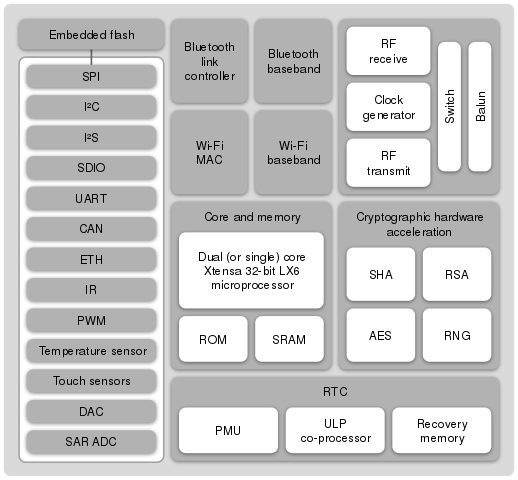

## Components

### E-ink display: the DKE Group DEPG0290B1
The DKE Group DEPG0290B1 is used on the SHA Badge.
This display might be hard to come by so we also support an alternative: the *to-do*.

Datasheet: [DEPG0290B01V3.0.pdf](DEPG0290B01V3.0.pdf)

The datasheet does a very good job explaining how to initialize the display and get it to picture something.
The LUT is explained in the section below, because THAT isn't really documented at all... 

#### Look Up Table (LUT)
The LUT is a small 'program' the display executes each time you refresh the display.
It is arranged in two sections of 35 bytes. The first half configures voltages (TBD).
The second half is the program.

```
  // Voltages and other settings? Timing?
   0xA0,	0x90,	0x50,	0x0,	0x0,	0x0,	0x0,
   0x50,	0x90,	0xA0,	0x0,	0x0,	0x0,	0x0,
   0xA0,	0x90,	0x50,	0x0,	0x0,	0x0,	0x0,
   0x50,	0x90,	0xA0,	0x0,	0x0,	0x0,	0x0,
   0x00,	0x00,	0x00,	0x0,	0x0,	0x0,	0x0,

   // Update program
   //
   // Top three lines are the main program (bottom 4 have unknown function)
   // Line 1: Negative image
   // Line 2: White/Black flashing
   // Line 3: Positive image
   //
   // Line construction
   // First two bytes denote Intensity (range 0x00 to 0x0F)
   // Second two bytes denote lenght of each 'pulse' (range 0x00 to 0xFF)
   // Last byte denotes number of repeats (0 = line runs 1 time, range 0x00 to 0xFF)
   // If you don't want a line to do anything, set all bytes to 0x0.
   // This way you can make a quick update cycle between two screens.
   // Maybe not as pretty/crisp but nice and fast is also awesome!

   // Negative image
   // first two bytes negative image, length white pulse (0-FF), length black pulse (0-FF), last byte repeats

   0xF,	0xF,	0x0,	0x0,	0x0,

   // White or black flash
   // white flash intensity, black flash intensity, length white pulse (0-FF), length black pulse (0-FF), repeats

   0xF,	0xF,	0x0,	0x0,	0x02,

   // Positive image
   // first byte or second byte positive image (don't know why you need both), rest same as above

   0xF,	0xF,	0x0,	0x0,	0x0,

   // Unknown what lines below actually do.
   // They seem to be programs to, but have no visible effect on dislay.
   0x0,	0x0,	0x0,	0x0,	0x0,
   0x0,	0x0,	0x0,	0x0,	0x0,
   0x0,	0x0,	0x0,	0x0,	0x0,
   0x0,	0x0,	0x0,	0x0,	0x0,
```

### Microcontroller: the Espressif ESP32 Wroom module

The SHA2017Badge uses a Special ESP-WROOM-32 module with a 128 Mbit flash

ESP32 is a series of low cost, low power system on a chip microcontrollers with integrated Wi-Fi & dual-mode Bluetooth.
The ESP32 series employs a Tensilica Xtensa LX6 microprocessor in both dual-core and single-core variations.
ESP32 is created and developed by Espressif Systems, a Shanghai-based Chinese company, and is manufactured by TSMC using their 40 nm process.
It is a successor to the ESP8266 microcontroller.

#### Features
Features of the ESP32 include the following:

 - CPU: Xtensa Dual-Core 32-bit LX6 microprocessor, operating at 160 or 240 MHz and performing at up to 600 DMIPS
 - Memory: 520 KiB SRAM
 - Wireless connectivity:
  * Wi-Fi: 802.11 b/g/n/e/i
  * Bluetooth: v4.2 BR/EDR and BLE
 - Peripheral interfaces:
  * 12-bit SAR ADC up to 18 channels
  * 2 × 8-bit DACs
  * 10 × touch sensors
  * Temperature sensor
  * 4 × SPI
  * 2 × I²S
  * 2 × I²C
  * 3 × UART
  * SD/SDIO/MMC host
  * Slave (SDIO/SPI)
  * Ethernet MAC interface with dedicated DMA and IEEE 1588 support
  * CAN bus 2.0
  * IR (TX/RX)
  * Motor PWM
  * LED PWM up to 16 channels
  * Hall effect sensor
  * Ultra low power analog pre-amplifier
 - Security:
  * IEEE 802.11 standard security features all supported, including WFA, WPA/WPA2 and WAPI
  * Secure boot
  * Flash encryption
  * 1024-bit OTP, up to 768-bit for customers
  * Cryptographic hardware acceleration: AES, SHA-2, RSA, elliptic curve cryptography (ECC), random number generator (RNG)
 - Power Management
  * Internal LDO
  * Individual power domain for RTC
  * 5uA deep sleep current
  * Wake up from GPIO interrupt, timer, ADC measurements, capacitive touch sensor interrupt
  


### Touch controller: the MPR121 Touch Sensor and GPIO expander

The Freescale/NXP MPR121 serves as both the capacitive touch controller and as a GPIO expander on the badge. It is connected to the ESP32 through I2C and an interrupt line. 

#### Documents

 - [Datasheet](MPR121.pdf)
 - [AN3819: Baseline system application note](AN3819.pdf)
 - [AN3894: MPR121 GPIO/LED driver application note](AN3894.pdf)

#### Connections
 - The MPR121 is connected to the ESP32 through I2C on pins IO26 (SDA) and IO27 (SCL).

 - Software pullups are not necessary, as there are two pullup resistors on the board.

 - The MPR's interrupt pin is connected to IO25 on the ESP.

 - Its I2C slave address is 0x5A.

The MPR121 has twelve electrode connections (ELE0-11), of which eight can be used as GPIO. We are using the last four electrode connections as I/O. 

| Electrode | GPIO  | Function / direction | Connection                           |
| --------- | ----- | -------------------- | ------------------------------------ |
| ELE0      | \-    | Touch                | A                                    |
| ELE1      | \-    | Touch                | B                                    |
| ELE2      | \-    | Touch                | Start                                |
| ELE3      | \-    | Touch                | Select                               |
| ELE4      | GPIO0 | Touch                | Down                                 |
| ELE5      | GPIO1 | Touch                | Right                                |
| ELE6      | GPIO2 | Touch                | Up                                   |
| ELE7      | GPIO3 | Touch                | Left                                 |
| ELE8      | GPIO4 | Push/pull output     | Vibration motor                      |
| ELE9      | GPIO5 | Input                | TP4056 Charge status                 |
| ELE10     | GPIO6 | Push/pull output     | WS2812 / SD Card power enable        |
| ELE11     | GPIO7 | Input                | SD Card detect<br />*NOT FUNCTIONAL* |


#### Touch

The most important function of the MPR121: capacitive touch. I (Kartoffel) will describe how I was able to get it to work, though it might not be ideal and definitely needs tweaking. I left a lot of registers unexplored, and did not implement the over current detection which can halt the IC.


The basic setup steps:


 - Initialize global baseline filter (registers 0x2B to 0x40) - see AN3891 for information about the baseline system.

 - Set the touch and release thresholds for each electrode (registers 0x41 to 0x5A).

 - Set electrode sample interval (register 0x5D) - this directly influences the current consumption.


Finally, to get the MPR121 into run mode:


 - Enable the electrodes for touch detection (register 0x5E) - set this to 0x08 to enable just ELE0-ELE7 to make sure we can use the rest as GPIO.


Now the MPR is in run mode and scanning the touch electrodes.


When the state of an electrode changes the interrupt pin will go low, and the state should be read by the ESP. Register 0x0 holds the touch status of ELE0 to ELE7. 

#### GPIO
We are using ELE8-11 (GPIO4-7) as GPIO. The MPR uses eight registers to control its GPIO pins: 

| Register | Function       |
|----------|----------------|
| 0x73     | GPIO Control 0 |
| 0x74     | GPIO Control 1 |
| 0x75     | GPIO Data      |
| 0x76     | GPIO Direction |
| 0x77     | GPIO Enable    |
| 0x78     | Data set       |
| 0x79     | Data clear     |
| 0x7A     | Data toggle    |

In order to use the GPIO pins, we first have to initialize them:


 - Set the GPIO direction of IO4 and IO6 as output, IO5 and IO7 as input. (adress 0x76, data 0x50)

 - Set the control registers. For CMOS outputs and inputs without pullups, both of these should be set to 0 for GPIO4-7. (adress 0x73, data 0x00 and adress 0x74, data 0x00)

 - Enable GPIO4-7 by writing 0xF0 to the GPIO Enable register. (adress 0x77, data 0xF0)


Next, the two output pins can be set to HIGH, LOW, or their state can be toggled with the Data Set, Data Clear, and Data Toggle registers. The state of the input pins can be read in register 0x01.


The GPIO5 and GPIO7 inputs have external pullup resistors, so they do not need internal bias. 

#### IRQ

The IRQ-pin is connected to the ESP32 on IO25. It is an active-low pin that triggers on a touch-event (being touched or no longer being touched) and resets upon reading the registers via I2c. That way you can easily do an interrupt in your code or choose to ignore inputs until you have time to handle them. 

### LEDs: the blinky LEDs you can add

There are six pads for WS2812 or SK6812 LEDs on the front. Guess what? You can add them on yourself! Why? Because adding components to the front of the board is expensive (the board has to go through the machine twice). Have no fear, at camp there are plenty of capable hackers to help you if soldering isn't your thing. 

#### How to blink

The LEDs are powered via a mosfet switched on by ELE10 on the MPR121 (i2c adress 0x5A, write to register 0x78, data 0x40).
After that, blast your favorite WS2812 or SK6812 routine through GPIO32 on the ESP32! Have fun burning your eyes!


Using our platform firmware? See the neopixel API description for more information.

```
import neopixel
data = [0xFF, 0xFF, 0xFF, 0xFF]*6 #Fully turn on all the LEDs
neopixel.send(bytes(data))
```

#### Expanding
More you say? You want more? Sure, The data-out from the last LED is broken out on the expansion connector.


Be careful with drawing power from this connector, you could burn out the regulator, a fuse or just drain your battery really fast! 

### Power and battery

 - [TP4056 Battery charger](TP4056.pdf)
 - [AP2114H 3.3V LDO regulator](AP2114.pdf)
  * Pin-compatible with the AMS1117, but we do not recommend that one because of its high quiescent current consumption!

#### Battery

The SHA2017 badge uses a lithium polymer battery.

|               |                                               |
|---------------|-----------------------------------------------|
| Technology    | Lithium Polymer                               |
| Capacity      | 1000mAh                                       |
| Cells         | 1 (1S, 3.7v)                                  |
| Protection    | Built-in: over/under voltage and over current |
| Connector     | JST-PH3                                       |


### USB-serial: Silicon Labs CP2102

Requires driver under macOS, found at the [Silicon Labs website](https://www.silabs.com/products/development-tools/software/usb-to-uart-bridge-vcp-drivers)

### Add-ons
Connector pinout:

|              |           |       |       |              |         |
|--------------|-----------|-------|-------|--------------|---------|
| GND          | LED_POWER | IO_33 | IO_16 | IO_17        | I2C_SCL |
| 3V3_SWITCHED | GND       | IO_12 | IO_4  | LED_DATA_OUT | I2C_SDA |

### Hacks
#### Weatherproofing
 - Nailpolish seems to do the trick. Switches on the back will probably be unusable after applying it...


 - Plastik70 from Kontakt Chemie works ok (cover switches, USB and SD card slot with tape before spraying it) 
